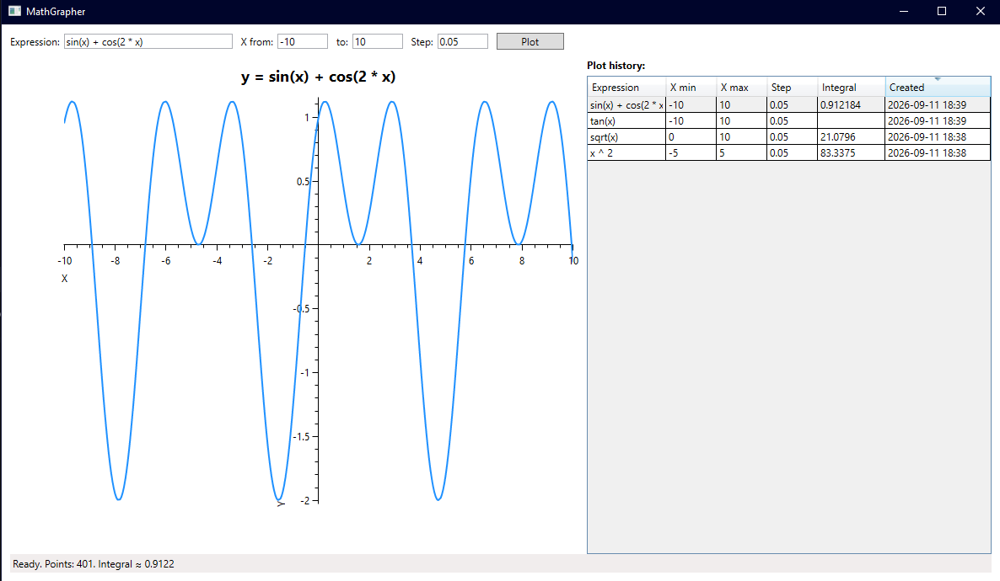

# MathGrapher

[](https://github.com/KezzGR/math-grapher/actions/workflows/ci.yml)

MathGrapher is a small Windows desktop application that parses mathematical expressions, plots functions, estimates definite integrals, and stores graph history locally.



## Download

Download the ready-to-run Windows build from the [latest release](https://github.com/KezzGR/math-grapher/releases/latest). Extract the ZIP archive and run `MathGrapher.exe`. The .NET runtime is included.

## Features

- Plot expressions over a configurable X range and sampling step.
- Parse expressions with a custom Shunting Yard implementation.
- Reuse the parsed RPN representation for every sampled X value.
- Estimate signed definite integrals using the trapezoidal rule.
- Break plotted lines around non-finite values and likely discontinuities.
- Store graph history in a local SQLite database.
- Restore previous expressions by double-clicking history entries.
- Validate malformed expressions, invalid ranges, and excessive sample counts.

## Supported expressions

MathGrapher supports:

- Variable: `x`
- Operators: `+`, `-`, `*`, `/`, `^`
- Parentheses and unary minus
- Constants: `pi`, `e`, `tau`
- Trigonometric functions: `sin`, `cos`, `tan`
- Inverse trigonometric functions: `asin`, `acos`, `atan`
- Hyperbolic functions: `sinh`, `cosh`, `tanh`
- Other functions: `sqrt`, `cbrt`, `abs`, `exp`
- Natural logarithms: `ln`, `log`
- Base-10 logarithm: `log10`

Angles are measured in radians. Decimal numbers use a point, and multiplication must be explicit: write `2 * x`, not `2x`.

Example:

```text
sin(x) + cos(2 * x)
```

## How expression evaluation works

The expression engine is implemented without an external parsing library:

1. The input string is tokenized into numbers, operators, functions, constants, parentheses, and the variable `x`.
2. The Shunting Yard algorithm converts the infix expression into Reverse Polish Notation (RPN).
3. The RPN token sequence is stored once for the current expression.
4. Each X value is evaluated using a stack-based RPN evaluator.

This avoids parsing the same expression again for every point on the graph.

## Numerical integration

MathGrapher estimates the signed definite integral over the selected interval using the trapezoidal rule.

If sampling encounters non-finite values or detects a likely discontinuity, the graph is split at that location and the integral is not reported for the interval.

## Technology

- C# and .NET 10
- WPF
- OxyPlot
- SQLite through `Microsoft.Data.Sqlite`
- xUnit

## Running from source

Requirements:

- Windows
- .NET 10 SDK
- Git

Clone the repository:

```powershell
git clone https://github.com/KezzGR/math-grapher.git
cd math-grapher
```

Run the application:

```powershell
dotnet run --project MathGrapher/MathGrapher.csproj
```

## Running tests

```powershell
dotnet test
```

The test suite covers expression parsing, operator precedence, supported functions, invalid expressions, numerical integration, and file-backed SQLite history.

## Local data

Graph history is stored at:

```text
%LocalAppData%\MathGrapher\history.db
```

The database and its table are created automatically. No external database server or manual schema setup is required.

## Project structure

```text
math-grapher/
├── MathGrapher/              WPF user interface
├── MathGrapher.Core/         Expression parser, integration, and persistence
├── MathGrapher.Core.Tests/   xUnit test suite
└── docs/images/              README assets
```

## Current limitations

- The application is Windows-only because it uses WPF.
- Expressions support one variable: `x`.
- Functions accept one argument.
- Discontinuity detection is sampling-based rather than symbolic.
